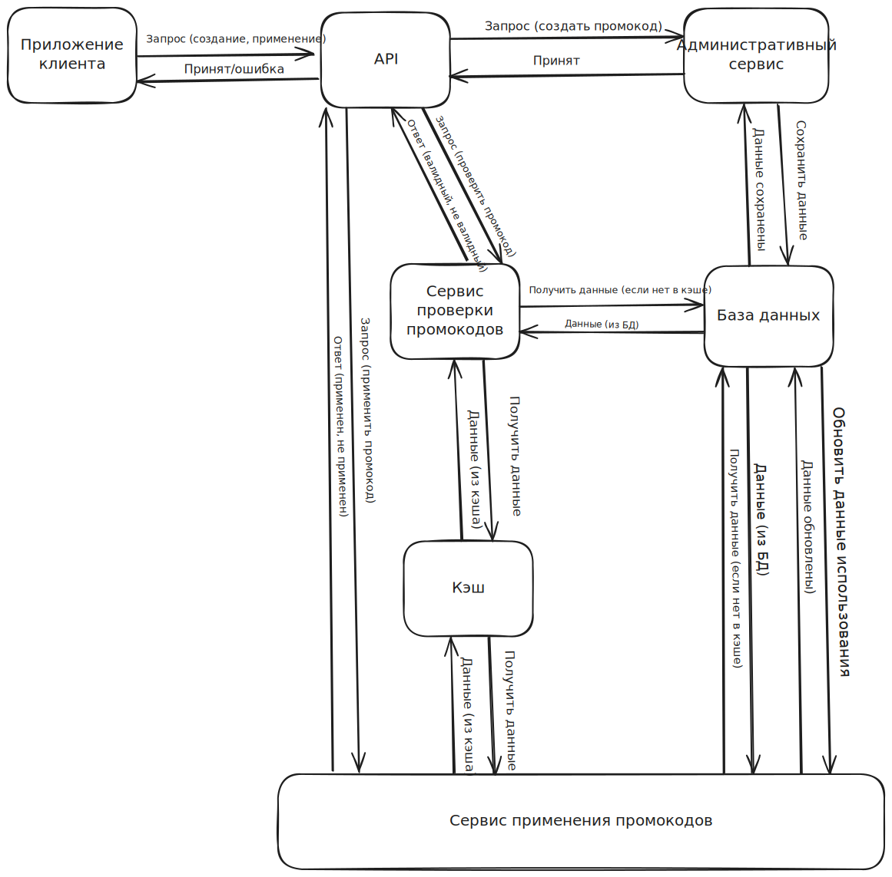

# Система управления промокодами

Оценка объема и масштабирования:

•   Количество запросов в секунду (RPS):

    •   Среднее количество проверок в день: 2,000,000
    •   Проверок в секунду: 2,000,000 / (24 × 60 × 60) ≈ 23 RPS (это среднее значение, пики могут быть выше)
    •   Мы можем предположить, что пиковая нагрузка может быть в 3-5 раз выше среднего, поэтому, возможно, нам нужно будет обрабатывать до 100-115 RPS на пике.
    
•   Расчет объема сохраняемых данных:

    •   Предположим, что в день создается около 10,000 новых промокодов.
    •   Каждый промокод (включая код, тип скидки, срок действия и т.д.) занимает примерно 500 байт.
    •   В день сохраняется: 10,000 * 500 байт = 5 MB
    •   В год сохраняется: 5 MB * 365 = 1.8 GB.
    
•   Расчет объема читаемых данных:

    •   Так как промокоды проверяются 2 млн раз в день, мы можем предположить, что считывание данных промокодов происходит 2 млн раз в день, это 5-10 мб в день если мы будем считать что из БД вытягиваются только данные необходимые для проверки.
    •   Также нужно учитывать чтение для статистики и административных задач, но оно будет значительно меньше проверок.

•   API Gateway:

    •   Балансировка нагрузки между серверами.
    •   Аутентификация и авторизация запросов.
    •   Маршрутизация запросов к нужным сервисам.
    
•   Административный сервис (Admin Service):

    •   Принимает запросы на создание промокодов.
    •   Генерирует уникальные коды, если это необходимо.
    •   Сохраняет информацию о промокодах в базе данных.
    
•   Сервис проверки промокодов (Validation Service):

    •   Получает запросы с кодом промокода.
    •   Проверяет, существует ли промокод, является ли он валидным (срок действия, ограничения по использованию).
    •   Использует кэш для ускорения проверки.
•  Сервис применения промокодов (Application Service):

    •   Регистрирует использование промокода пользователем (уменьшает счетчик использования, если есть ограничение).
    •   Сохраняет информацию об использовании в БД.
